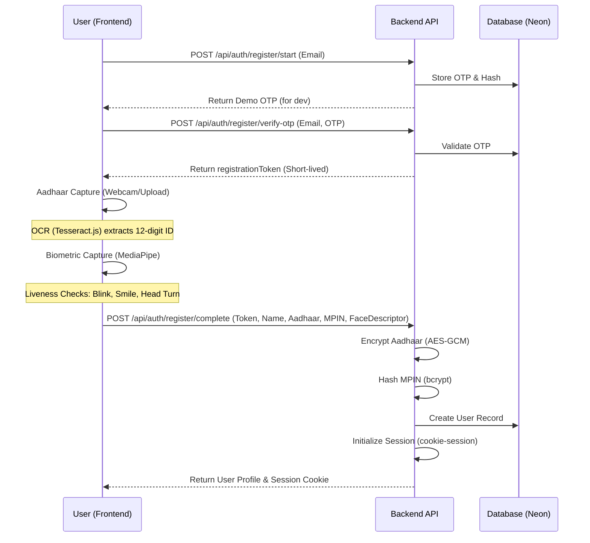
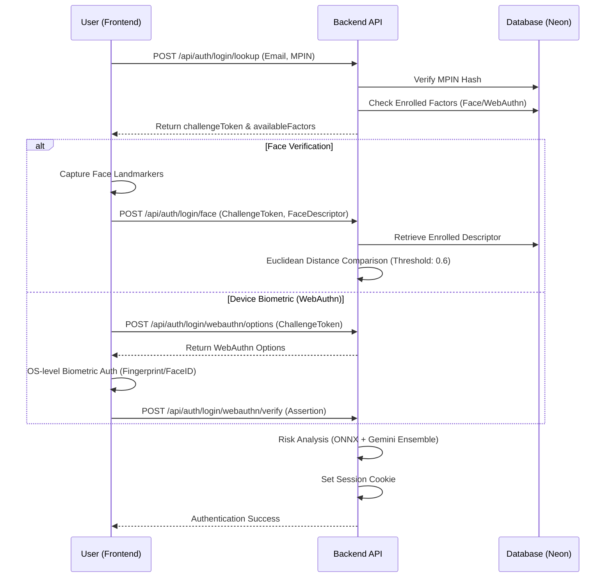

# AuthFusion System Flows

This document outlines the end-to-end flows for the AuthFusion Identity Platform, covering user interactions and backend logic.

## 1. User Registration Flow (SignUp)

The registration flow is a multi-step process designed to ensure identity proofing and biometric enrollment.

### Key Security Features in SignUp:
- **Liveness Verification**: Ensures the user is a real person, not a photo/video.
- **Data Encryption**: Aadhaar numbers are never stored in plain text.
- **Rate Limiting**: Protected against OTP brute-forcing via Upstash Redis.

---

## 2. User Authentication Flow (Login)

AuthFusion uses a two-factor approach: Knowledge (MPIN) + Inherence (Face/Biometric).

---

## 3. Backend Architecture Flow

The backend is built for security, scalability, and type safety.

### Request Pipeline:
1. **Security Headers**: `helmet` adds strict security headers (CORS, COOP, COEP).
2. **Rate Limiting**: `Upstash Ratelimit` checks the IP address against a sliding window.
3. **Session Middleware**: `cookie-session` decrypts the session cookie to identify the user.
4. **tRPC / REST Routing**: Requests are routed to specific controllers with Zod validation.
5. **Database Layer**: `Drizzle ORM` performs type-safe queries to the Neon PostgreSQL database.

### Risk Detection Flow:
- **Client-side**: ONNX Runtime Web analyzes behavioral patterns (keystrokes/mouse) and generates a risk score.
- **Server-side**: The backend integrates with Gemini to analyze the context of the login attempt (IP changes, unusual timing).
- **Audit Logging**: Every success and failure is logged in the `activity_events` table for forensic analysis.

---

## 4. Cross-Device Handoff (QR Flow)

Allows a user on a Desktop to use their Mobile device for biometric enrollment.

1. **Desktop**: Requests a handoff session.
2. **Backend**: Generates a `handoff_token` and starts a Socket.io room.
3. **Desktop**: Displays QR code containing the mobile URL + token.
4. **Mobile**: Scans QR, navigates to `/m/h/:token`.
5. **Mobile**: Performs biometric capture and sends data to Backend.
6. **Backend**: Emits `handoff-complete` via WebSockets to the Desktop.
7. **Desktop**: Automatically proceeds to the next step.
